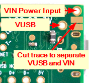

# INFO
This a a blank slate for developing your own ideas on delta^ eurorack module.
Delta code runs on teensy LC, developed on VSC + platformIO.
It has the basic functions to read buttons, and write on gate OUTs, cv OUTs and LEDs.
In the function files youll see also an example of Encoder reads, Short and Long button presses.
The hardware file states all the pin USED, please also refer to teensy LC documentation.
Its not very well commented out, feel free to get in touch for more info.

IMPORTANT NOTE: To allow delta to be powered while working on Teensy LC, you will need to cut the Teensy LC's VUSB-VIN pads apart (5V power is already coming from the board). Please refer to the picture.

